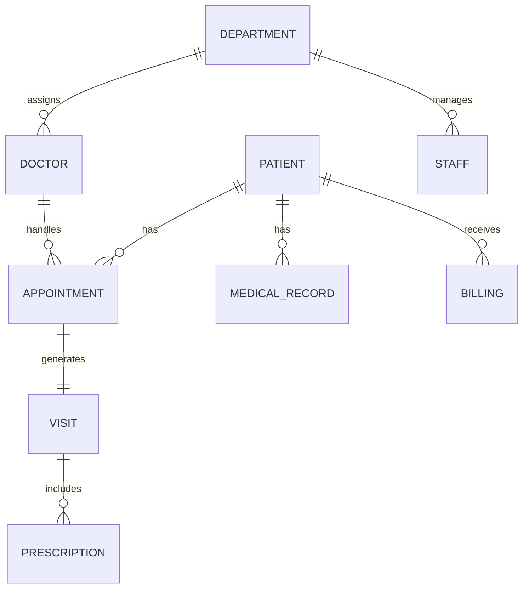

# hospital-management-schema.drawio.svg
This repository contains the Entity Relationship Diagram (ERD) for a hospital management database. The ERD outlines the relationships between key entities like Patients, Doctors, Appointments, and Visits. Designed for educational purposes to demonstrate database schema planning
## **Schema Overview**  
### Key Tables  
1. **Patients**: Core patient data.  
2. **Doctors**: Specialist details.  
3. **Appointments**: Scheduling.  
4. **Visits**: Clinical encounters.  
5. **Prescriptions**: Medications.  
6. **Medical_Records**: Health history.  
7. **Departments**: Hospital units.  
8. **Staff**: Nurses/admins.  
9. **Billing**: Financial records.  
10. **Rooms**: Facility management.  

